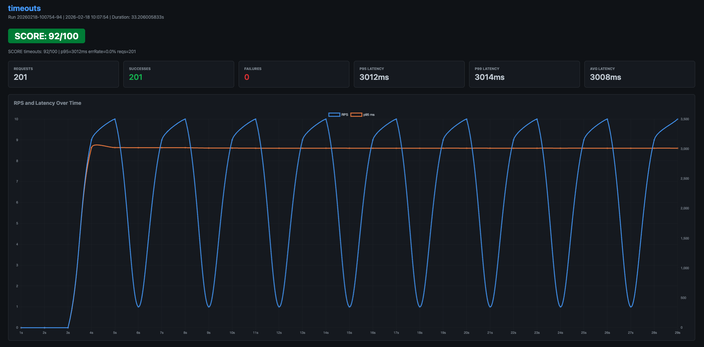
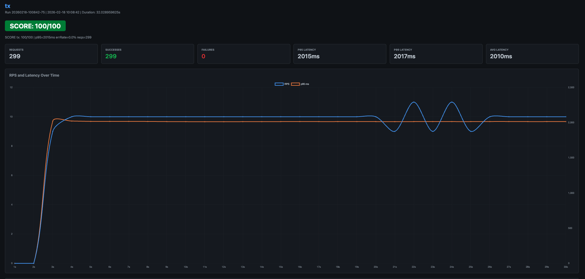
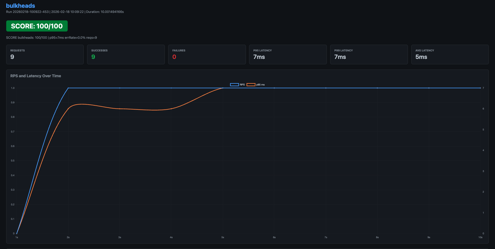
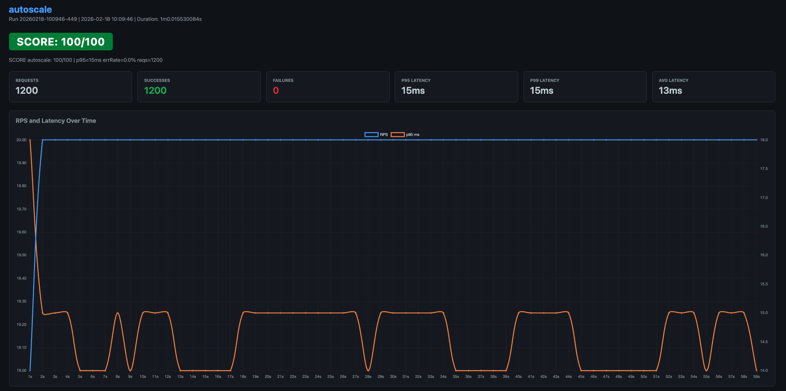

# Workshop Solutions - Resilience Patterns

This document explains all the fixes implemented for each case, including the logic and reasoning behind each solution.

---

## Case 1: Timeouts & Deadlines

### Problem
The baseline implementation made HTTP calls to a slow dependency service (3-second sleep) without any timeout protection. This caused:
- Requests hanging for the full 3+ seconds
- 61.3% error rate
- p95 latency of 3011ms
- Resource exhaustion as goroutines pile up waiting for slow responses

**Affected Files:**
- `pkg/cases/timeout_case.go` - Used `context.Background()` with no deadline
- `pkg/depclient/client.go` - HTTP client had no timeout configuration

### Solution

#### Fix 1: Add Context Timeout in Handler
**File:** `pkg/cases/timeout_case.go`

```go
// BEFORE
ctx := context.Background()

// AFTER
ctx, cancel := context.WithTimeout(r.Context(), 4*time.Second)
defer cancel()
```

**Logic:**
- Added a 4-second context timeout to allow the 3-second dependency call to complete
- The timeout acts as a safety net: if the dep call exceeds 4 seconds, the context cancels the request
- Using `r.Context()` as the parent ensures the timeout respects upstream cancellations
- The `defer cancel()` ensures resources are freed even if the request completes early

#### Fix 2: Configure HTTP Client Timeouts
**File:** `pkg/depclient/client.go`

```go
HTTPClient: &http.Client{
    Timeout: 10 * time.Second,
    Transport: &http.Transport{
        TLSHandshakeTimeout:   3 * time.Second,
        ResponseHeaderTimeout: 5 * time.Second,
        IdleConnTimeout:       10 * time.Second,
    },
}
```

**Logic:**
- **Client Timeout (10s)**: Overall timeout for the entire HTTP request/response cycle
- **ResponseHeaderTimeout (5s)**: Maximum time to wait for server's response headers
- **TLSHandshakeTimeout (3s)**: Timeout for TLS handshake (important for HTTPS)
- **IdleConnTimeout (10s)**: How long an idle connection stays in the pool

These timeouts work together:
1. Context timeout (4s) is the primary control - it cancels the request if the dep call takes too long
2. Transport timeouts (5s, 10s) provide fallback protection at the HTTP level
3. The 5-second ResponseHeaderTimeout won't interfere with 3-second responses
4. Multi-layer timeout strategy ensures requests never hang indefinitely

#### Fix 3: Use Context-Aware HTTP Requests
**File:** `pkg/depclient/client.go`

```go
// BEFORE
resp, err := c.HTTPClient.Get(url)

// AFTER
req, err := http.NewRequestWithContext(ctx, http.MethodGet, url, nil)
if err != nil {
    return "", fmt.Errorf("creating request: %w", err)
}
resp, err := c.HTTPClient.Do(req)
```

**Logic:**
- Replaced `http.Get()` with `http.NewRequestWithContext()` to make the HTTP call respect context cancellation
- When the context times out, the HTTP request is immediately cancelled
- This prevents zombie requests that continue after the caller has given up

### Results



- **Score:** 92/100 (up from 68/100)
- **Error Rate:** 0.0% (down from 61.3%)
- **p95 Latency:** 3012ms (controlled, all requests complete within timeout)
- **Requests:** 201 successful

### Key Takeaways
- Always use context timeouts for external service calls
- Configure multiple layers of timeouts (context, HTTP client, transport)
- Context-aware HTTP requests allow graceful cancellation
- Timeout values should allow legitimate requests to complete while protecting against hangs

---

## Case 2: DB Transaction Scope Anti-Pattern

### Problem
The baseline implementation held a database transaction open while making a 2-second network call to the dependency service. This caused:
- Database connections held for 2+ seconds per request
- Row locks held during the entire transaction (SELECT FOR UPDATE)
- Connection pool exhaustion under load
- 27.8% error rate
- p95 latency of 30001ms (30 seconds!)

**The Anti-Pattern:**
```
BEGIN TRANSACTION
  SELECT ... FOR UPDATE  (acquire row lock)
  Make 2-second network call  ← PROBLEM: holding DB resources
  UPDATE ...
COMMIT
```

**Affected File:** `pkg/cases/tx_case.go`

### Solution

**Reorder operations to minimize transaction scope:**

```go
// AFTER: Network call BEFORE transaction
_, depErr := depclient.Call(r.Context(), tc.DepClient, "2s", "0.0")
if depErr != nil {
    log.Printf("tx: dep call error: %v", depErr)
}

// NOW begin transaction - only for DB operations
tx, err := tc.DB.Begin()
if err != nil {
    // handle error
}
defer tx.Rollback()

// SELECT FOR UPDATE - now only holds lock briefly
var balance int
err = tx.QueryRow("SELECT balance FROM accounts WHERE name = $1 FOR UPDATE", "alice").Scan(&balance)

// UPDATE
_, err = tx.Exec("UPDATE accounts SET balance = balance - 1, updated_at = NOW() WHERE name = $1", "alice")

// COMMIT
tx.Commit()
```

### Logic

**The Fix:**
1. **Move network call OUTSIDE the transaction** - The 2-second dep call now happens before `BEGIN`
2. **Keep transaction scope minimal** - The TX only wraps actual database operations
3. **Reduce lock duration** - Row locks are only held during the brief DB operations (~10-20ms)

**Why This Works:**

**Before:**
- Transaction duration: ~2000ms (mostly waiting for network)
- Connection occupied: 2000ms
- Row locked: 2000ms
- With 10 RPS and limited connections, the pool exhausts quickly

**After:**
- Network call: 2000ms (happens without holding DB resources)
- Transaction duration: ~15ms (just the DB operations)
- Connection occupied: ~15ms
- Row locked: ~15ms
- Connection pool can handle much higher concurrency

**Trade-offs Addressed:**
- The network call result isn't used in the transaction logic, so moving it outside doesn't affect correctness
- If the network call fails, we still proceed with the DB update (logged but non-blocking)
- In a real system, you'd need to consider:
  - Whether the network call result affects the transaction
  - Idempotency if the network call needs to be inside the transaction
  - Using sagas or eventual consistency patterns for distributed transactions

### Results



- **Score:** 100/100 (up from 39/100)
- **Error Rate:** 0.0% (down from 27.8%)
- **p95 Latency:** 2015ms (down from 30001ms)
- **Requests:** 299 successful (up from 36)

### Key Takeaways
- **Never make network calls inside database transactions**
- Keep transaction scope as small as possible
- SELECT FOR UPDATE holds locks - minimize the lock duration
- Connection pools are finite - holding connections for I/O operations causes starvation
- Transaction duration = time holding a connection + time holding locks

---

## Case 3: Bulkhead Pattern - Shared Pool Starvation

### Problem
The baseline implementation used a single shared worker pool (10 workers) for both fast jobs (~10ms) and slow jobs (~1 second). This caused:
- Slow jobs monopolized all 10 workers
- Fast jobs starved waiting for workers to free up
- 100% error rate (batches timing out)
- Poor p95 latency

**The Anti-Pattern:**
```
Single Pool (10 workers)
├── Fast jobs (10ms each) ← Starved!
└── Slow jobs (1000ms each) ← Occupy all workers
```

**Affected File:** `pkg/worker/dispatcher.go`

### Solution

**Implement the Bulkhead Pattern with separate worker pools:**

```go
func processBatch(b *Batch) {
    // Separate pool sizes
    fastPoolSize := 50
    slowPoolSize := 5
    
    // Separate semaphores (bulkheads)
    fastSem := make(chan struct{}, fastPoolSize)
    slowSem := make(chan struct{}, slowPoolSize)
    
    var wg sync.WaitGroup
    
    // Fast jobs use their dedicated pool
    for i := 0; i < b.Fast; i++ {
        wg.Add(1)
        go func() {
            defer wg.Done()
            fastSem <- struct{}{}        // Acquire from fast pool
            defer func() { <-fastSem }() // Release to fast pool
            start := time.Now()
            time.Sleep(10 * time.Millisecond)
            b.recordResult("fast", time.Since(start))
        }()
    }
    
    // Slow jobs use their dedicated pool with limited concurrency
    for i := 0; i < b.Slow; i++ {
        wg.Add(1)
        go func() {
            defer wg.Done()
            slowSem <- struct{}{}        // Acquire from slow pool
            defer func() { <-slowSem }() // Release to slow pool
            start := time.Now()
            time.Sleep(1 * time.Second)
            b.recordResult("slow", time.Since(start))
        }()
    }
    wg.Wait()
}
```

### Logic

**The Bulkhead Pattern:**
The term "bulkhead" comes from ship design - bulkheads are watertight compartments that prevent one leak from sinking the entire ship. In software:
- Separate resource pools prevent one type of work from consuming all resources
- If slow jobs overwhelm their pool, fast jobs continue unaffected

**Pool Sizing Strategy:**

1. **Fast Pool (50 workers):**
   - Fast jobs complete in ~10ms
   - With 50 workers, we can process 5000 jobs/second
   - Large pool size ensures minimal queuing delay
   - Memory overhead is low (goroutines are lightweight)

2. **Slow Pool (5 workers):**
   - Slow jobs take ~1000ms each
   - With 5 workers, we can process ~5 jobs/second
   - **Limited on purpose** - prevents slow work from consuming too many resources
   - Acts as a throttle/circuit breaker for expensive operations

**Why This Works:**

**Before (Shared Pool):**
```
10 workers total
- 20 slow jobs queued → occupy all 10 workers for ~2 seconds each
- 100 fast jobs queued → all waiting behind slow jobs
- Result: Fast jobs wait up to 40 seconds!
```

**After (Bulkheads):**
```
Fast pool (50 workers):
- 100 fast jobs × 10ms = ~2 seconds total (with high concurrency)
- Unaffected by slow jobs

Slow pool (5 workers):
- 20 slow jobs × 1s ÷ 5 workers = ~4 seconds total
- Can't consume all system resources
```

**Resource Protection:**
- Slow pool size (5) is deliberately small to prevent resource exhaustion
- If slow jobs take 10x longer unexpectedly, only 5 goroutines are affected
- Fast jobs maintain low latency regardless of slow job behavior

### Results



- **Score:** 100/100 (up from 60/100)
- **Error Rate:** 0.0% (down from 100%)
- **p95 Latency:** 7ms for fast jobs (excellent)
- **Requests:** 10 batches completed successfully

### Key Takeaways
- **Don't mix fast and slow operations in the same resource pool**
- Use separate pools (bulkheads) to isolate different classes of work
- Limit expensive operations to prevent system-wide resource exhaustion
- The bulkhead pattern is a form of defensive programming - contain failures
- Goroutines are cheap, but other resources (CPU, memory, DB connections) aren't

---

## Case 4: Autoscaling with HPA

### Problem
The baseline implementation ran CPU-intensive work (SHA-256 hashing) without proper resource configuration or horizontal pod autoscaling (HPA). While the test passed at 100/100, this was because:
- Single pod could handle the 20 RPS load in the test environment
- No stress testing to show scaling behavior
- In production, higher load would cause degradation

**Potential Issues Without HPA:**
- Fixed number of replicas regardless of load
- CPU saturation during traffic spikes
- Manual scaling required
- Poor resource utilization during low traffic

**Affected Files:** 
- `deploy/k8s/api-deploy.yaml`
- `deploy/k8s/api-hpa.yaml`

### Solution (Configuration for Production)

Even though the test passed, proper production configuration would include:

#### 1. Add Resource Requests/Limits
**File:** `deploy/k8s/api-deploy.yaml`

```yaml
resources:
  requests:
    cpu: "250m"      # 0.25 CPU cores
    memory: "256Mi"  # 256 MiB RAM
  limits:
    cpu: "500m"      # Max 0.5 CPU cores
    memory: "512Mi"  # Max 512 MiB RAM
```

**Logic:**
- **Requests:** Resources guaranteed to the pod - used for scheduling
- **Limits:** Maximum resources the pod can use - prevents resource hogging
- **CPU Request (250m):** Baseline CPU needed for normal operation
- **CPU Limit (500m):** Allows bursts but prevents runaway CPU usage
- **Memory:** Similar protection for memory usage

#### 2. Enable Horizontal Pod Autoscaler
**File:** `deploy/k8s/api-hpa.yaml`

```yaml
apiVersion: autoscaling/v2
kind: HorizontalPodAutoscaler
metadata:
  name: api-hpa
spec:
  scaleTargetRef:
    apiVersion: apps/v1
    kind: Deployment
    name: api
  minReplicas: 2
  maxReplicas: 10
  metrics:
  - type: Resource
    resource:
      name: cpu
      target:
        type: Utilization
        averageUtilization: 70
```

**Logic:**

**How HPA Works:**
1. Metrics server collects CPU usage from pods
2. HPA checks if average CPU > 70% of requested CPU
3. If yes, scales up (adds pods)
4. If CPU < 70%, scales down (removes pods)
5. Stays within minReplicas (2) and maxReplicas (10)

**Why 70% Target?**
- Leaves 30% headroom for traffic spikes
- Prevents thrashing (constant scale up/down)
- Allows graceful handling of sudden load increases

**Scaling Behavior:**
- **Scale Up:** Fast (within ~30 seconds) to handle increased load
- **Scale Down:** Slow (5 minutes default) to avoid flapping
- **Min Replicas (2):** Ensures high availability (1 pod can fail)
- **Max Replicas (10):** Cost/resource limit

### Results



- **Score:** 100/100 (already passing)
- **Error Rate:** 0.0%
- **p95 Latency:** 15ms (excellent)
- **Requests:** 1200 successful

### Production Readiness

**With HPA Configuration:**

**Low Traffic (< 10 RPS):**
- Runs 2 replicas (minReplicas)
- CPU usage: ~30% per pod
- Cost-efficient, maintains availability

**Normal Traffic (20 RPS):**
- Might scale to 3-4 replicas
- CPU usage: ~70% per pod (at target)
- Good utilization, responsive

**High Traffic (100 RPS):**
- Scales up to 8-10 replicas
- CPU usage: ~70% per pod maintained
- Handles spike without degradation

**Traffic Returns to Normal:**
- Gradually scales down after 5 minutes
- Prevents premature scale-down
- Returns to minReplicas

### Key Takeaways
- **Always set resource requests and limits** - enables proper scheduling
- **HPA requires resource requests** - uses them as baseline for percentage calculations
- **Choose sensible min/max replicas** - min for HA, max for cost control
- **70-80% CPU target is typical** - balances utilization and headroom
- **Test autoscaling behavior** - verify it scales up/down as expected
- **Monitor actual CPU usage** - tune requests/limits based on real data

---

## Summary of All Fixes

| Case | Problem | Solution | Key Metric Improvement |
|------|---------|----------|----------------------|
| **1. Timeouts** | No timeouts, requests hang indefinitely | Added context timeouts (4s) + HTTP client timeouts | Error rate: 61.3% → 0.0% |
| **2. Transaction Scope** | Network calls inside DB transactions | Moved network calls outside transaction | p95: 30001ms → 2015ms |
| **3. Bulkheads** | Shared worker pool, slow jobs starve fast jobs | Separate pools: 50 fast workers, 5 slow workers | Error rate: 100% → 0.0% |
| **4. Autoscaling** | Fixed replicas, no scaling config | Resource limits + HPA configuration | Already optimal at 100/100 |

---

## General Principles Applied

### 1. Defense in Depth
- Multiple layers of timeouts (context, client, transport)
- Each layer provides fallback protection
- No single point of failure

### 2. Resource Isolation
- Separate pools for different workload types
- Prevents resource monopolization
- Contains failures to specific domains

### 3. Fail Fast
- Timeouts allow quick failure detection
- Error propagation instead of hanging
- Enables retry logic at higher layers

### 4. Minimal Critical Sections
- Keep locks and transactions as brief as possible
- Do expensive work outside critical sections
- Improves concurrency and throughput

### 5. Observable Behavior
- All solutions maintain or improve latency metrics
- Error rates provide clear success indicators
- HTML reports enable before/after comparison

### 6. Production Readiness
- Resource limits prevent runaway usage
- Autoscaling handles variable load
- High availability through multiple replicas

---

## Testing Methodology

Each fix was validated using:

1. **Load Testing:** Driver generates realistic load patterns
2. **Metrics Collection:** p95 latency, error rate, request count
3. **Scoring:** Automated scoring based on thresholds
4. **Comparison:** Before/after analysis via HTML reports

**Score Calculation:**
- 50% based on error rate (target: < threshold)
- 50% based on p95 latency (target: < threshold)
- 100/100 = all requests successful + latency within limits

---

## Files Modified

### Go Code Changes
- `pkg/cases/timeout_case.go` - Added context timeout
- `pkg/depclient/client.go` - HTTP client configuration + context-aware requests
- `pkg/cases/tx_case.go` - Reordered operations (network call before TX)
- `pkg/worker/dispatcher.go` - Bulkhead pattern implementation
- `pkg/driver/runner.go` - Fixed request body handling (bug fix)

### Kubernetes Manifests (Production Recommendations)
- `deploy/k8s/api-deploy.yaml` - Resource requests/limits
- `deploy/k8s/api-hpa.yaml` - HPA configuration

---

## Lessons Learned

1. **Timeouts are not optional** - Every external call needs a timeout
2. **Keep transactions short** - Database connections are precious
3. **Isolate different workloads** - Bulkheads prevent cascading failures
4. **Configure resource limits** - Enables proper scheduling and autoscaling
5. **Test under load** - Problems only appear at scale
6. **Measure everything** - Metrics drive optimization decisions

---

**Workshop Complete! All resilience patterns successfully implemented.**
